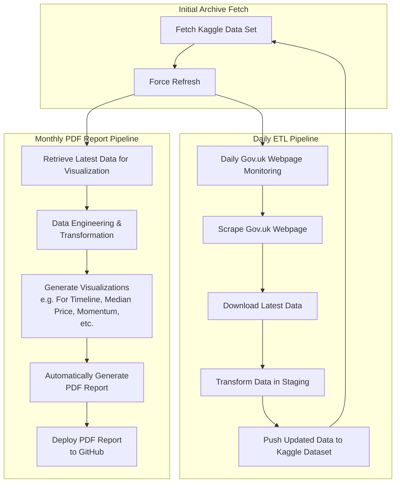

# **Full Report: Automated London Property Price Analysis Report**

This **full report** is a comprehensive, fully automated **monthly PDF report** as part of our data-driven pipeline for analyzing UK property transactions. Unlike the mini report, this **full version contains a wider set of in-depth analyses**, providing a **detailed breakdown of market trends, pricing movements, and transaction dynamics across London and other areas**.

## **Overview**

This report aims to **help homebuyers, investors, and researchers** understand the **UK property market trends** based on official data from the **UK Government's HM Land Registry**. The pipeline **automates data collection, processing, transformation, visualization, and reporting**, ensuring **each month's report contains the latest market insights**.

### **Data Sources and Pipeline Automation**
The dataset is sourced directly from **HM Land Registry's "Price Paid Data"** and automatically updated **every month**. The pipeline ensures **timely and consistent updates** by:
- **Daily monitoring** of the official **Gov.uk** website.
- **Scraping and downloading** new transaction data as soon as it is available.
- **Transforming and cleaning** data before integrating it into the Kaggle dataset.
- **Generating the latest property analysis visualizations**.
- **Publishing the updated report** to GitHub.

## **Pipeline Architecture**
This report is generated through a structured **ETL (Extract, Transform, Load) pipeline**, illustrated in the **Mermaid diagram below**:

---

## **Topics Covered in the Full Report**
This full report expands upon the mini report with **deeper insights and additional analyses**.

1. **London’s Median Price Trends**
   - Monthly **median property prices** across **all of London**.
   - District-level **median price breakdowns**.

2. **Regional Price Movements**
   - **Trends in median prices by district**.
   - **Comparison between different boroughs**.
   - **Historical price shifts across London**.

3. **Heatmaps for Market Insights**
   - **Average property price distribution heatmap** (color-coded for affordability).
   - **Transaction volume heatmap** (shows most active areas for property sales).

4. **Momentum & Market Dynamics**
   - **Daily transaction momentum analysis** with moving averages.
   - **Short-term vs long-term trends** in London’s housing market.

5. **Top 10 Boroughs & Postal Codes**
   - **Ranking of highest median-priced boroughs**.
   - **Most active property transaction locations** (ranked by sales volume).

6. **Annual Growth Rate Analysis**
   - **Year-over-year price growth by borough**.
   - **Comparison of current vs last year’s trends**.

7. **Property Type-Specific Trends**
   - Breakdown of **median price movements by property type** (Detached, Semi-Detached, Terraced, Flats).
   - **Growth comparison per housing category**.

8. **London's Housing Market Since 2020**
   - **Long-term trends in sales volume & prices** from **2020 to present**.

## **Report Format**
- **Landscape PDF format** for better visualization.
- **Each chart is presented in both English & Traditional Chinese**.
- **One visualization per page** for clarity.
- **Final blank page indicates the end of the report**.

## **Accessing the Report**
- The latest version of the **full report** is published in the [GitHub full-reports folder](https://github.com/entzyeung/uk-property-analysis/tree/main/full-reports).

---

## **Conclusion**
This **full report provides an extensive, automated analysis of London’s real estate market**, helping professionals, investors, and homeowners stay informed with **data-driven insights**. With automated **data collection, transformation, visualization, and reporting**, this project delivers **accurate and timely information every month**.

For inquiries or collaboration opportunities, please contact **Lorentz Yeung**.
