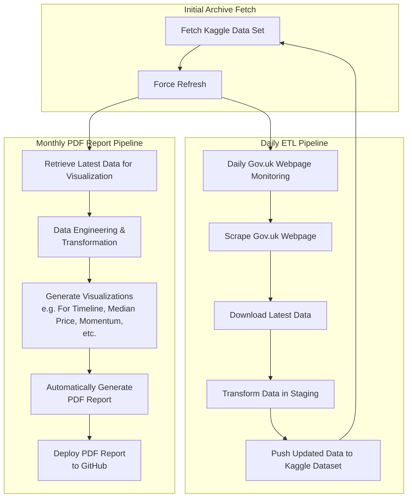

# **Full Report: Automated London Property Price Analysis Report**

This **full report** is a fully automated **monthly PDF report** as part of our data-driven pipeline for analyzing London property transactions. Unlike the mini report, this **full version contains a wider set of analyses and insights**, providing a **detailed breakdown of market trends, pricing movements, and transaction dynamics across London**.

## **Overview**

This report aims to **help Hong Kongers** understand the **London property market trends** based on official data from the **UK Government's HM Land Registry**. The pipeline **automates data collection, engineering, transformation, visualization, modelling and reporting**, ensuring **each month's report contains the latest market insights**.

### **Data Engineering and Pipeline Automation**
The dataset is sourced directly from **HM Land Registry's "Price Paid Data"** and automatically updated **every month**. The pipeline ensures **timely and consistent updates** by:
- **Daily monitoring** of the official **Gov.uk** website.
- **Scraping and downloading** new transaction data as soon as it is available.
- **Transforming and cleaning** data before integrating it into the Kaggle dataset.
- **Generating the latest property analysis visualizations**.
- **Producting PDF reports**.
- **Publishing and pushing reports** to GitHub.

## **Pipeline Architecture**
This report is generated through a structured **ETL (Extract, Transform, Load) pipeline**, illustrated in the **Mermaid diagram below**:

---

## **Topics Covered in the Full Report**
This full report expands upon the mini report with **deeper insights and additional analyses**.

  Each section is clearly separated into different pages.
  - Section 1: Overall monthly median price trend  
  - Section 2: District-level median price trends (with separate detailed subplots)  
  - Section 3: Heat map for average prices  
  - Section 4: Heat map for transaction counts  
  - Section 5: Top 20 postcode-based transaction count heat map  
  - Section 6: 4 property types median price trends and table  
  - Section 7: Highest value cities analysis (using total transaction values and new properties)  
  - Section 8: YoY median price growth (same period comparison)  
  - Section 9: YoY median price growth (same month comparison)  
  - Section 10: Timeline comparison for transaction count and median price  
  - Section 11: Transaction momentum analysis  
  - Section 12: Monthly growth table for median and mean prices  

## **Report Format**
- **PDF format**
- **Each chart is presented in Traditional Chinese only.(Planning to provide the English version in the future.**.
- **One visualization per page** for clarity.

## **Accessing the Report**
- The latest version of the **full report** is published in the [GitHub full-reports folder](https://github.com/entzyeung/uk-property-analysis/tree/main/full-reports).
- The latest version of the **mini report** is published in the [GitHub mini-reports folder](https://github.com/entzyeung/uk-property-analysis/tree/main/mini-reports).
- The latest version of the **dataset** is published in the [Kaggle Dataset - UK Property Price official data (Monthly Update)](https://www.kaggle.com/datasets/lorentzyeung/price-paid-data-202304).
- All the archived scripts and reports are available here [GitHub Repo](https://github.com/entzyeung/uk-property-analysis).

---

## **Conclusion**
This **full report aims to proivde timely and, automated analysis of London’s real estate market**, helping Hong Kongers, investors, and homeowners stay informed with **data-driven insights**. With automated **data collection, data engineering, visualization, and reporting**, this project delivers **accurate and timely information every month**.

For inquiries or collaboration opportunities, please contact **Lorentz Yeung**.