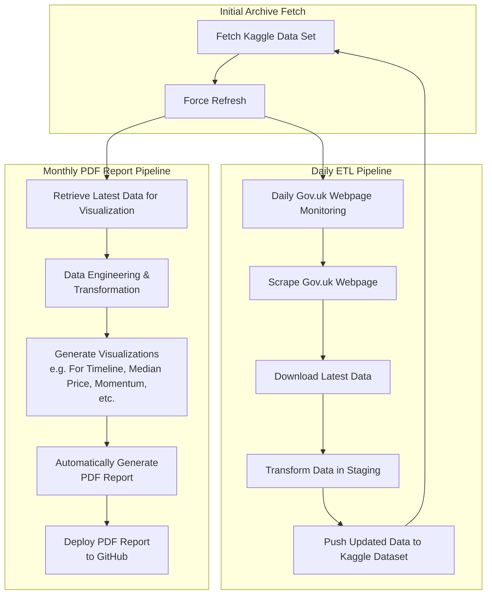

# Mini Report: Automated London Property Price Analysis Report

This mini report is a fully automated PDF generated monthly report as part of our comprehensive pipeline for analyzing UK property transactions (The latest Full PDF report is deployed to the [Download Folder on GitHub](https://github.com/entzyeung/uk-property-analysis/tree/main/full-reports)). The report includes six graphs in 3 analysis topics. Each analysis topic is presented first in English, then in Traditional Chinese, providing a clear and bilingual overview of market trends.

## Overview

The mini report is a concise, visual summary of the latest trends in the UK property market. It includes three key analysis topics:

- **Timeline Count Analysis:** Displays monthly property transaction counts.
- **Median Price Timeline:** Shows the evolution of median property prices.
- **Momentum Analysis:** Visualizes daily transaction momentum via rolling averages.

Each topic is presented in both English and Traditional Chinese, ensuring accessibility to a diverse audience.

## Pipeline Architecture

The report generation is integrated within a larger automated data pipeline. The process is illustrated in the Mermaid diagram below:

### How It Works

1. **Initial Archive Fetch & Daily ETL Pipeline:**  
   - The system forces a refresh of the Kaggle dataset.
   - Daily, it monitors the Gov.uk webpage, scrapes and downloads the latest data, transforms it, and pushes the updated dataset back to Kaggle.

2. **Monthly PDF Report Pipeline:**  
   - The latest data is retrieved and further engineered for visualization.
   - Six visualizations are automatically generated (three topics, each in English and Traditional Chinese).
   - A PDF report is compiled in landscape format, with each graph on a separate page.
   - The final report is deployed to GitHub.

## Report Generated Included

The mini report contains the following visualizations:

1. **Timeline Count Analysis:**  
   - **English Version:** Monthly property transaction counts.  
   - **Chinese Version:** Same analysis presented in Traditional Chinese.

2. **Median Price Timeline:**  
   - **English Version:** Evolution of median property prices.  
   - **Chinese Version:** Same timeline in Traditional Chinese.

3. **Momentum Analysis:**  
   - **English Version:** Daily transaction momentum with rolling averages.  
   - **Chinese Version:** Same momentum analysis in Traditional Chinese.

## Usage

- **Automatic Updates:**  
  The mini report is updated monthly as part of our fully automated pipeline.

- **Accessing the Report:**  
  The latest PDF report is deployed to the [mini-reports folder on GitHub](https://github.com/entzyeung/uk-property-analysis/tree/main/mini-reports).

- **Report Format:**  
  The report is generated in landscape orientation. Each page hosts a single visualization, and a final blank page indicates the end of the report.

## Conclusion

This mini report serves as a demo of the final output of the wider data analysis pipeline. By combining automated data collection, processing, and bilingual visualization, the mini report makes it easy understand what the wider project is doing.

For any questions or further details, please contact **Lorentz Yeung**.
