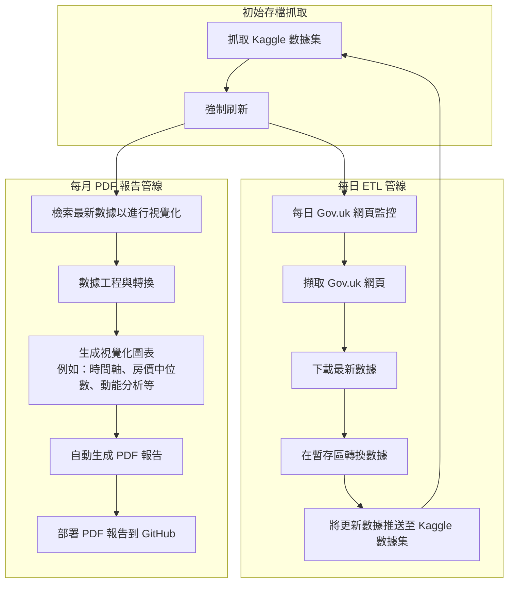

# 倫敦房產市場數據分析流程
(管讀我檔案是ChatGPT翻譯，一切如英文版為準)

本項目始於 2021 年初。

本存儲庫包含一個全自動化數據分析流程，用於監察、收集及分析直接來自英國政府土地註冊處（HM Land Registry）的英國房價數據。該數據分析流程整合了每日數據攝取、轉換與視覺化，生成每月 PDF 報告 —— 包含精簡的迷你報告，與深入的完整版報告 —— 提供有關倫敦房地產市場的即時洞見。

---

## 目錄

- [概述](#概述)
- [倉庫結構](#倉庫結構)
- [管線架構](#管線架構)
- [數據收集與 ETL 流程](#數據收集與-etl-流程)
- [報告生成](#報告生成)
  - [迷你報告](#迷你報告)
  - [完整版報告](#完整版報告)
- [授權許可](#授權許可)
- [聯絡方式](#聯絡方式)

---

## 概述

英國房產市場數據分析流程的設計目標在於：
- **自動監察** 官方價格成交數據網頁以獲取更新。
- **下載並存檔** 每月 CSV 文件及完整房價數據文件。
- **更新 Kaggle 數據集** 以保持歷史數據的累積記錄。
- **生成 PDF 報告** 以視覺化最新市場趨勢，分為精簡（迷你報告）與詳細（完整版報告）兩種格式。
- **服務雙語讀者**，提供英文與繁體中文的分析（完整版報告將進一步增強雙語功能）。

---

## GitHub Repo 結構

- **報告文件夾**  
  - **迷你報告：**  
    位於 [GitHub 迷你報告資料夾](https://github.com/entzyeung/uk-property-analysis/tree/main/mini-reports) 中。  
    包含一份精簡 PDF 報告，內含六個視覺化圖表（涵蓋三個分析主題，每個主題皆以英文與繁體中文呈現）。
  - **完整版報告：**  
    位於 [GitHub 完整版報告資料夾](https://github.com/entzyeung/uk-property-analysis/tree/main/full-reports) 中。  
    包含一份深入的 PDF 報告，附有額外章節、詳細分析及更多視覺化圖表（目前以繁體中文呈現）。

---

## 數據分析流程架構

本項目由一個全自動化 ETL（提取、轉換、加載）管線驅動，包含兩個主要工作流程：

1. **每日 ETL 管線**
   - **監察與擷取：**  
     檢查 Gov.uk 價格成交數據頁面是否有當月更新。
   - **數據下載與轉換：**  
     檢測到更新時，即下載最新數據、進行轉換，並整合至 Kaggle 數據集中。
   - **數據集更新：**  
     強制刷新機制確保 Kaggle 數據集保持最新，每月 CSV 文件累積存檔，完整數據集則每次替換。

2. **每月 PDF 數據分析流程**
   - **數據檢索與工程處理：**  
     將最新數據進一步處理以供視覺化使用。
   - **視覺化圖表生成：**  
     生成多個圖表以突顯主要市場趨勢，包括交易量、房價中位數演變及動能分析。
   - **PDF 編譯與部署：**  
     將視覺化圖表彙編成 PDF 報告（精簡迷你報告或詳細完整版報告），並自動發布至 GitHub。

下方 Mermaid 圖示說明了整體管線流程：

---

## 數據收集與 ETL 流程

- **監察：**  
  持續監察 Gov.uk 價格成交數據頁面，檢測「當前月份」更新的任何變化。
- **數據下載：**  
  檢測到更新時，新的每月 CSV 文件將被下載並與過往文件一併存檔。同時，完整數據集文件（pp-complete.csv）亦會刷新。
- **Kaggle 數據集更新：**  
  流程會利用 Kaggle API 更新數據集：
  - **累積** 每月 CSV 文件。
  - **替換** 完整數據集及更新追蹤文件（last_update.txt）。
  - **生成** 元數據文件（dataset-metadata.json），以促進正確的數據集版本管理。

---

## 報告生成

### 迷你報告

- **目的：**  
  提供一個簡明且視覺化的概覽，呈現英國房地產市場的最新趨勢。
- **內容：**
  - **時間軸交易量分析：**  
    以英文及繁體中文呈現的每月房地產交易量。
  - **房價中位數時間軸：**  
    房價中位數演變，雙語呈現。
  - **動能分析：**  
    每日交易動能（含移動平均），雙語呈現。
- **格式：**  
  橫向 PDF，每頁一個圖表，末頁為空白頁。

---

### 完整版報告

- **目的：**  
  提供對倫敦房地產交易的全面且詳細分析，呈現更深入的洞見與額外視覺化圖表。
- **內容：**  
  報告分為多個章節，包括：
  - * 每月整體房價中位數趨勢。
  - * 區域層級房價中位數趨勢（附有詳細子圖）。
  - * 平均價格及交易量熱力圖。
  - * 前 20 名郵遞區號交易量分析。
  - * 物業類型詳細劃分、高價值城市分析及年增率比較。
  - * 時間軸及動能分析。
- **格式：**  
  PDF 報告，每頁一個視覺化圖表，目前以繁體中文呈現（計劃提供英文版本）。

---

## 授權許可

本項目採用 MIT 授權許可。

---

## 聯絡方式

如有疑問、合作或需進一步資訊，請聯絡 **Lorentz Yeung**。