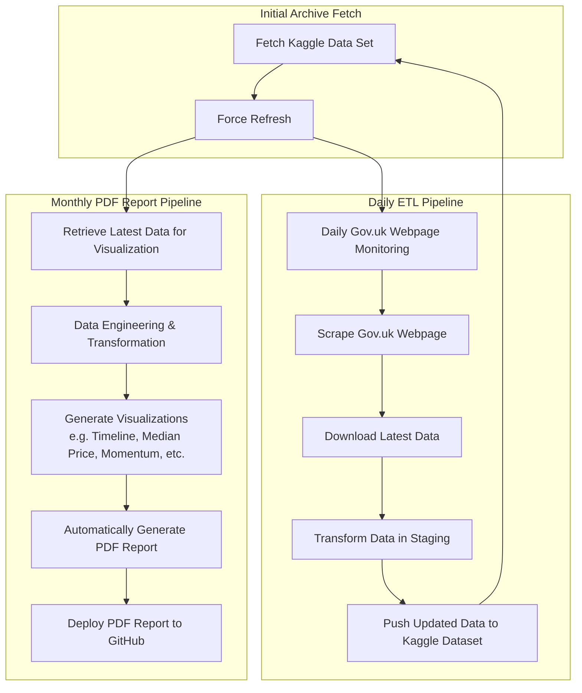

# London Property Market Analysis Pipeline

This repository contains a fully automated data engineering pipeline for monitoring, collecting, and analyzing UK property price data sourced directly from the UK Government’s HM Land Registry. The pipeline integrates daily data ingestion, transformation, and visualization to generate monthly PDF reports—both a concise mini report and an in-depth full report—offering timely insights into the London property market.

## Table of Contents

- [Overview](#overview)
- [Repository Structure](#repository-structure)
- [Pipeline Architecture](#pipeline-architecture)
- [Data Collection and ETL Process](#data-collection-and-etl-process)
- [Report Generation](#report-generation)
  - [Mini Report](#mini-report)
  - [Full Report](#full-report)
- [Installation and Dependencies](#installation-and-dependencies)
- [Usage](#usage)
- [Contributing](#contributing)
- [License](#license)
- [Contact](#contact)

## Overview

The UK Property Market Analysis Pipeline is designed to:
- **Automatically monitor** the official Price Paid Data webpage for updates.
- **Download and archive** monthly CSV files as well as a complete property price file.
- **Update a Kaggle dataset** to maintain an accumulated record of historical data.
- **Generate PDF reports** that visualize the latest market trends in both concise (mini) and detailed (full) formats.
- **Serve a bilingual audience** by providing analyses in English and Traditional Chinese (with further enhancements planned for the full report).

## Repository Structure
- **Report Folders**  
  - **Mini Reports:**  
    Located in the [mini-reports folder on GitHub](https://github.com/entzyeung/uk-property-analysis/tree/main/mini-reports).  
    Contains a concise PDF report with six visualizations (three analysis topics, each in English and Traditional Chinese).
  - **Full Reports:**  
    Located in the [full-reports folder on GitHub](https://github.com/entzyeung/uk-property-analysis/tree/main/full-reports).  
    Contains an in-depth PDF report with additional sections, detailed analyses, and a broader set of visualizations (currently in Traditional Chinese).

## Pipeline Architecture

The project is driven by an automated ETL (Extract, Transform, Load) pipeline that consists of two primary workflows:

1. **Daily ETL Pipeline**
   - **Monitoring & Scraping:**  
     The script checks the Gov.uk Price Paid Data page for any update to the current month.
   - **Data Download & Transformation:**  
     When an update is detected, the latest data is downloaded, transformed, and integrated into the Kaggle dataset.
   - **Dataset Update:**  
     A forced refresh mechanism ensures the Kaggle dataset remains current, with monthly CSV files accumulated and the complete dataset replaced each time.

2. **Monthly PDF Report Pipeline**
   - **Data Retrieval & Engineering:**  
     The latest data is further processed for visualization.
   - **Visualization Generation:**  
     Multiple charts are created to highlight key market trends, including transaction counts, median price evolution, and momentum analysis.
   - **PDF Compilation & Deployment:**  
     The visualizations are compiled into a PDF report—either as a concise mini report or a detailed full report—and automatically published to GitHub.

The following Mermaid diagram illustrates the overall pipeline:



## Data Collection and ETL Process
   - **Monitoring:**
       The script continuously monitors the Gov.uk Price Paid Data page for any change in the “current month” update.
   - **Data Download:**
       Upon detecting an update, a new monthly CSV file is downloaded and archived alongside previous monthly files. Simultaneously, the complete dataset file (pp-complete.csv) is refreshed.
   - **Kaggle Dataset Update:**
       The pipeline uses the Kaggle API to update the dataset:
          - **Accumulates** monthly CSV files.
          - **Replaces** the complete dataset and update tracking file (last_update.txt).
          - **Generates** a metadata file (dataset-metadata.json) to facilitate proper dataset versioning.


## Report Generation
### **Mini Report**
   - **Purpose:**
       Provides a concise, visual snapshot of the latest trends in the UK property market.
   - **Content:**
          - **Timeline Count Analysis:**
              Monthly property transaction counts in both English and Traditional Chinese.
          - **Median Price Timeline:**
              Evolution of median property prices, bilingual.
          - **Momentum Analysis:**
              Daily transaction momentum with rolling averages, bilingual.
   - **Format:**
       Landscape-oriented PDF with one chart per page and a concluding blank page.


### **Full Report**
   - **Purpose:**
     Offers a comprehensive, detailed analysis of London property transactions with deeper insights and additional visualizations.
   - **Content:**
     The report is divided into several sections, including:
          - Overall monthly median price trends.
          - District-level median price trends with detailed subplots.
          - Heat maps for average prices and transaction counts.
          - Top 20 postcode-based transaction count analysis.
          - Detailed breakdown of property types, high-value city analyses, and year-over-year growth comparisons.
          - Timeline and momentum analysis.
   - **Format:**
     PDF report with one visualization per page, currently presented in Traditional Chinese (with plans for an English version).


## Installation and Dependencies

Ensure you have Python 3.x installed. Then, install the necessary dependencies using:

```bash
pip install requests beautifulsoup4
```

For Kaggle API integration (used within Kaggle Notebooks), ensure you have the kaggle_secrets package set up.


